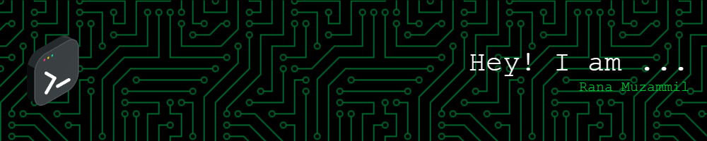

 

## 👋 About Me

I'm a **Software Engineer at i2c**, a global fintech enterprise, where I build and maintain **large-scale, mission-critical financial software** used across banking and payments infrastructure.

- 💼 Currently engineering **enterprise Java applications** with **Apache Struts**, REST APIs, and backend systems that power real-world financial products.
- 🧠 Alongside my professional work, I design and ship **full-stack applications** and **AI/GenAI systems** — from RAG pipelines to LangChain/LangGraph-based agents.
- 🎓 Computer Science graduate from **FAST-NUCES**, Pakistan.
- 🌱 Currently deepening my expertise in **MERN** and **Machine Learning**.
- 🎯 Long-term goal: work at the intersection of **enterprise-grade backend engineering** and **applied AI**, building software that is both reliable at scale and genuinely intelligent.
- ⚡ Fun fact: I get equal satisfaction from optimizing a legacy Java service and fine-tuning a RAG pipeline.

 

## 💼 Current Role

<table>
<tr>
<td width="70%">

**Software Engineer** · i2c Inc. (Global Fintech Enterprise)

Working on enterprise-scale financial applications built with **Java**, **Apache Struts**, and **REST APIs**, contributing to backend systems and software architecture that power secure, high-volume payment and banking products.

</td>
<td width="30%" align="center">

`Java` `Apache Struts` `REST APIs` `Enterprise Architecture`

</td>
</tr>
</table>

## 🎓 Education

**Bachelor's in Computer Science** — FAST-NUCES, Pakistan

 

## 🛠️ Tech Stack

**Languages**

**Backend & Enterprise**

**Frontend**

**Databases**

**AI / Machine Learning**

**Tools & Platforms**

 

## ⚡ Enterprise & AI Expertise

<table>
<tr>
<th align="left">🏢 Enterprise & Backend Engineering</th>
<th align="left">🤖 AI & Generative AI Engineering</th>
</tr>
<tr>
<td valign="top">

- Production experience in **large-scale financial software** at i2c
- **Java** & **Apache Struts** enterprise application development
- Designing and consuming **REST APIs**
- Backend architecture for **high-volume, secure** systems
- Full-stack delivery with **Node.js / Express / MongoDB**

</td>
<td valign="top">

- Building **RAG pipelines** with vector databases
- Agentic workflows using **LangChain** & **LangGraph**
- **NLP** systems for recommendation & text understanding
- **Deep learning** for applied use cases (e.g. medical imaging)
- Practical **prompt engineering** for production LLM apps

</td>
</tr>
</table>

 

## 🚀 Featured Projects

<table>
<tr>
<td width="50%" valign="top">

### 📚 [Bookify](https://github.com/RanaMuzammil272/BOOKIFY)
Full-stack **MERN** book platform for browsing, buying, and downloading books, with real-time chat and an admin-managed blog.

`MongoDB` `Express` `React` `Node.js` `Socket.io`

</td>
<td width="50%" valign="top">

### 🩺 AI-Powered Skin Cancer Detection System
Deep learning system that classifies skin lesion images to assist early skin cancer screening.

`Python` `Deep Learning` `CNN` `Healthcare AI`

</td>
</tr>
<tr>
<td width="50%" valign="top">

### 📰 News Recommendation System (NLP)
Content-based recommendation engine that suggests relevant news articles using NLP and text-similarity techniques.

`Python` `NLP` `Recommendation Systems`

</td>
<td width="50%" valign="top">

### 🤖 RAG-Based AI Assistant
Retrieval-Augmented Generation assistant combining an LLM with a vector store for grounded, context-aware answers.

`LangChain` `LangGraph` `Vector DB` `LLM`

</td>
</tr>
<tr>
<td width="50%" valign="top">

### 🧮 [Machine Learning Model Implementations](https://github.com/RanaMuzammil272/MachineLearning_Models_Implementations)
From-scratch implementations of core ML algorithms — K-Means, K-Medoids, DBSCAN, and a backpropagation neural network.

`Python` `Machine Learning` `Clustering`

</td>
<td width="50%" valign="top">

### 🧩 [AI Search Algorithms](https://github.com/RanaMuzammil272/AI-Searching-algorithms)
Implementations of classic AI search — Minimax, Alpha-Beta Pruning, BFS/DFS, A*, and IDDFS — applied to the 8-Puzzle and pathfinding.

`Python` `Artificial Intelligence` `Search Algorithms`

</td>
</tr>
</table>

<i>More on my <a href="https://github.com/RanaMuzammil272?tab=repositories">pinned repositories →</a></i>

 

## 📊 GitHub Analytics

 

## 🐍 Contribution Snake

<picture>
  <source media="(prefers-color-scheme: dark)" srcset="https://raw.githubusercontent.com/RanaMuzammil272/RanaMuzammil272/output/github-contribution-grid-snake-dark.svg" />
  <source media="(prefers-color-scheme: light)" srcset="https://raw.githubusercontent.com/RanaMuzammil272/RanaMuzammil272/output/github-contribution-grid-snake.svg" />
  
</picture>

  

## 🤝 Connect With Me

